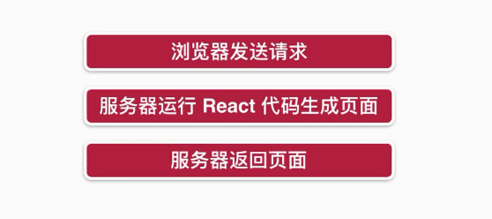
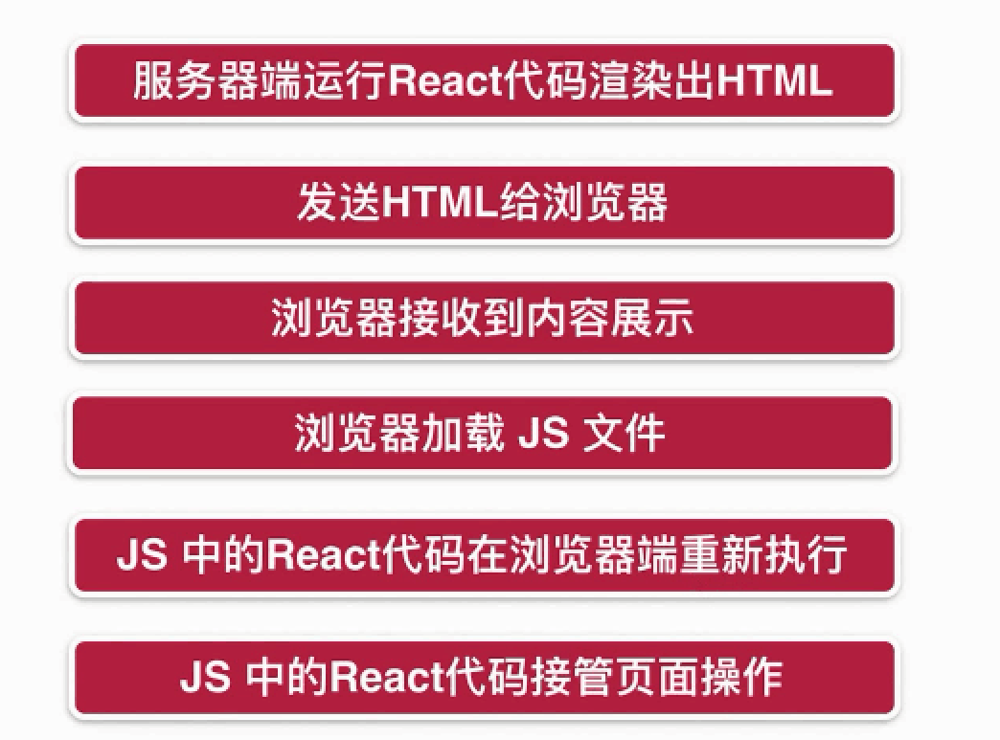
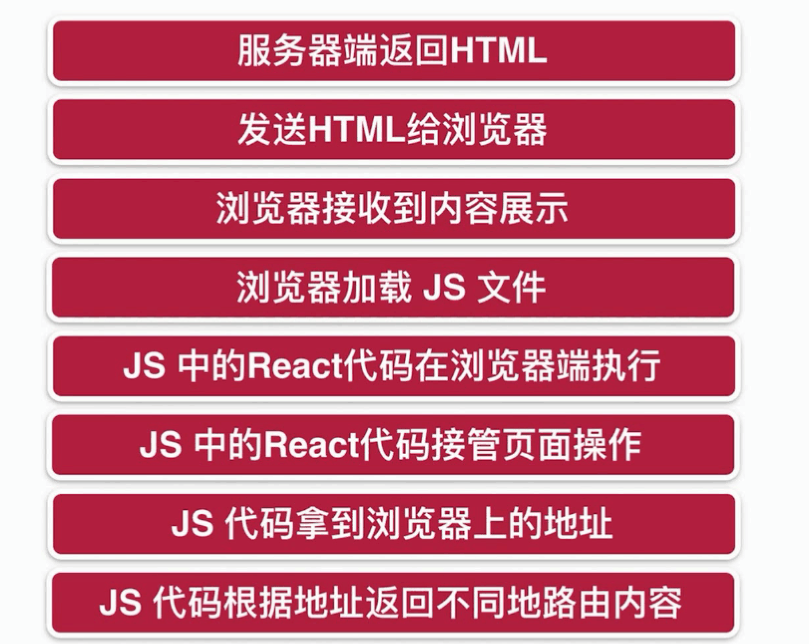

# SSR-react

## 客户端渲染


## 服务端渲染



## CSR和SSR优劣

* **CSR :** 
* React代码在浏览器中运行 消耗的是用户浏览器的性能
* **SSR :**
* React代码在服务器端运行,消耗的是服务器的性能
* 只发生在第一次进入页面的时候

## 在服务器端编写React组件

* Common Js规范 引入React
* 配置webpack 遇到.js文件 使用babel进行编译
* 安装babel-loader @babel/core 和对应的preset包 \(注意babel 7.0版本兼容性的问题\)

## **Babel**

**babel可以将当前运行平台\(浏览器、node服务器\)尚不支持的下一代或几代js语法编译为当前支持的js语法版本，比如可以把es6 es7和es8的js代码编译为es5的代码**

* **plugin: babel的插件，在6.x版本之后babel必需要配合插件来进行工作**
* **preset: babel插件集合的预设，包含某一部分的插件plugin**
* Plugin 会运行在 Preset 之前,Plugin 会从第一个开始顺序执行,ordering is first to last.Preset 的顺序则刚好相反\(从最后一个逆序执行\)。

## **同构**

**一套React代码,在服务器端执行一次\(获取数据,渲染页面\),在客户端也执行一次.\(执行js代码\)**



\*\*\*\*

为了提供诸如图像、CSS 文件和 JavaScript 文件之类的静态文件，使用 Express 中的 `express.static` 内置中间件函数。

```text
express.static(root, [options])
```

例如，通过如下代码就可以将 `public` 目录下的图片、CSS 文件、JavaScript 文件对外开放访问了：

```text
app.use(express.static('public'))
```

现在，你就可以访问 `public` 目录中的所有文件了：

```text
http://localhost:3000/images/kitten.jpg
http://localhost:3000/css/style.css
http://localhost:3000/js/app.js
http://localhost:3000/images/bg.png
http://localhost:3000/hello.html
```

## **服务端渲染中的路由**



## 引入react-router-dom

* CSR:使用BrowserRouter
* SSR:使用StaticRouter\(不知道浏览器当前的location\(路径\)\),\(只能用户req请求获取location\)

## 引入Redux

1. 创建store,引入相关中间件,combine reducer
2. 编写reducer \(初始化state,接收action\)
3. 编写action \(请求数据,并做相关处理\)

## 服务端渲染异步数据

The gist of this approach relies on a static route config used to both render your routes and match against before rendering to determine data dependencies.

* 根据请求的路由不同,求出要加载哪些组件
* 给store提前注入相关组件需要的数据
* 从react-router-config中引入matchRoutes用于多级路由和其对应组件的匹配,
* 调用数据接口时,返回其promise. 使用Promise.all等待数据全部获取后,开始生成页面

### 数据注水和脱水

* 注水 : 服务端渲染时 将数据写入全局对象window中
* 脱水:  客户端渲染时,从全局对象中取出数据\(放入store）

## Node作为中间层获取数据

* 客户端渲染:直接请求远程api服务 获取数据
* 服务端渲染:请求先到node server,  node server在去请求远程服务,获取数据,渲染页面后返回
* 使用express-http-proxy 让客户端的请求也经过中间层
* tip: 将client,server的axios的实例注入到redux-thunk的withExtraArgumen中

### SSR中的样式修饰

* css-loader: The `css-loader` interprets `@import` and `url()` like `import/require()` and will resolve them.
* 开启模块化css:将css-loader的option中将modules设为true 
* style-loader:  Adds CSS to the DOM by injecting a `<style>` tag
* server渲染时不存在window对象, 所以用iosmorphic-style-loader代替style-loader, 
* 引入模块化的styles后 通过styles.\_getCss\(\)获取css代码传入全局context中 最后render html的时候将css代码手动注入到style tage中即可


